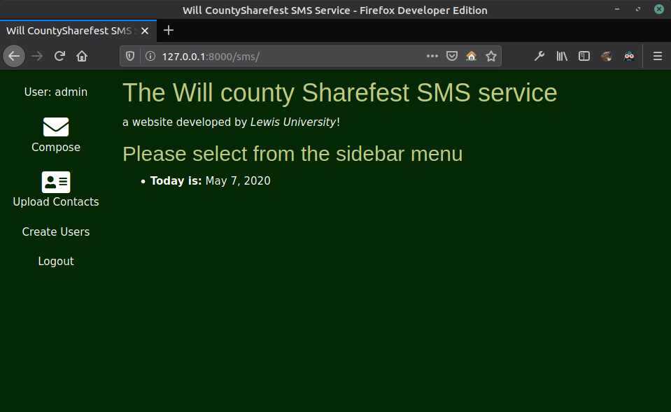
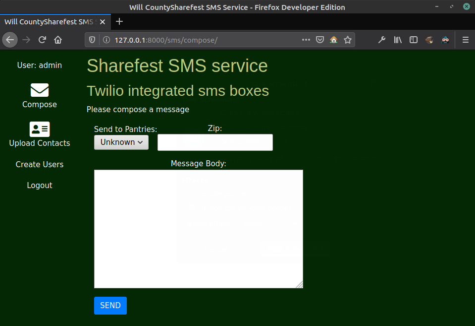
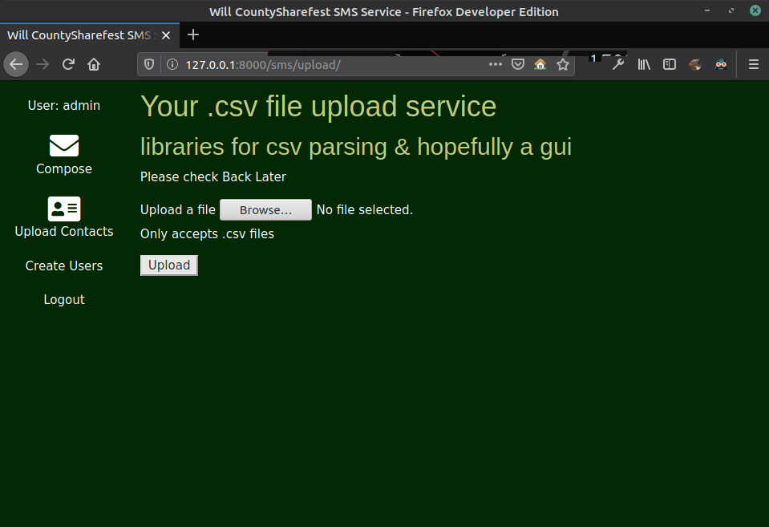
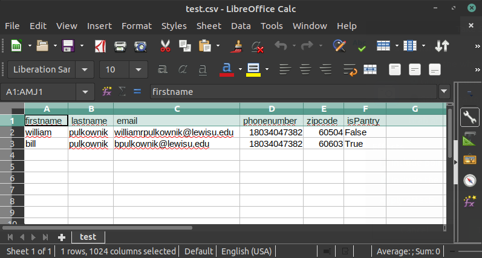

# Sharefest SMS service [](https://www.python.org/) 

Sharefest SMS service is a simple Django web app used to broadcast SMS
messages to clients or food pantries

<p align="center">
  
</p>

* uses twilio messaging service client to send messages to clients
  based on their zipcode and whether they are a pantry or a community member
<p align="center">
  
</p>

* accepts .csv files of contacts into a SQLite database
<p align="center">
  
</p>

* Contact .csv files should be in the following format
  **firstname, lastname, email, phonenumber, zipcode, isPantry**
<p align="center">
  
</p>

## What does sharefest SMS depend on?
* [Django3.0](https://docs.djangoproject.com/en/3.0/)
* [django-phone-field](https://pypi.org/project/django-phone-field/)
* [Twilio](https://www.twilio.com/docs/libraries/python)
* [Python3.x](https://www.python.org)
* [SQLite](https://https://www.sqlite.org/index.html)
* when this is finally pushed to production
  it will also require Heroku and probably postgreSQL

## Config

1. Clone the repo

2. after installing Django and site dependencies, navigate to 
   the folder containing the site and run
   ```sh
   $ python manage.py runserver
   ```
   this will start the server at your local host, usually at 127.0.0.1:8000. 
   This is the home page shown above

3. since the DB is still public, you will have the full collection of accounts and 
   contacts. Once the DB is private, you will have to create your own collections of users if you are not working on the production machine

4. 127.0.0.1/admin will bring you to the Admin panel

### Site Structure
Django is a simple web app building framework.
The structure of the app follows a simple pattern
<details><summary><b>Show details</b></summary>
I have outlined the most relative parts of our app
```
sharefest/
    manage.py 
    db.sqlite3
    
    sharefest/     <--- our site manager folder
        __init__.py
        settings.py
        urls.py
        asgi.py
        wsgi.py
    sms/            <--- location of sms service and web pages
        static/css
            styles.css
        admin.py
        apps.py
        forms.py    <--- forms for collecting input
        models.py   <--- location of DB models
        urls.py     <--- routes for our site
        views.py    <--- where the data processing happens
    templates/      <--- this folder contains the html
        baseGeneric.html
        compose.html
        upload.html
        ...
    README.md <--- what you are looking at right now
</details>

## How to use?
This main functionality site was designed to be as simple as possible
There are not too many moving parts:
you can log in, upload files, and send messages

## Contribute
This site is a work in progress. Future students will be making improvements.
We need:
* Security review
* Better error handling
* Better styling

any proposed contributions or pull requests should be made to
[this github](https://github.com/mongoosePK/ShareFest-1)

### License
Copyright 2020 William Pulkownik

Permission is hereby granted, free of charge, to any person obtaining a copy of this software and associated documentation files (the "Software"), to deal in the Software without restriction, including without limitation the rights to use, copy, modify, merge, publish, distribute, sublicense, and/or sell copies of the Software, and to permit persons to whom the Software is furnished to do so, subject to the following conditions:

The above copyright notice and this permission notice shall be included in all copies or substantial portions of the Software.

THE SOFTWARE IS PROVIDED "AS IS", WITHOUT WARRANTY OF ANY KIND, EXPRESS OR IMPLIED, INCLUDING BUT NOT LIMITED TO THE WARRANTIES OF MERCHANTABILITY, FITNESS FOR A PARTICULAR PURPOSE AND NONINFRINGEMENT. IN NO EVENT SHALL THE AUTHORS OR COPYRIGHT HOLDERS BE LIABLE FOR ANY CLAIM, DAMAGES OR OTHER LIABILITY, WHETHER IN AN ACTION OF CONTRACT, TORT OR OTHERWISE, ARISING FROM, OUT OF OR IN CONNECTION WITH THE SOFTWARE OR THE USE OR OTHER DEALINGS IN THE SOFTWARE.

<!-- BADGES
[](http://sharefest.sms.service.not/)

[](https://www.python.org/) 

END BADGES -->